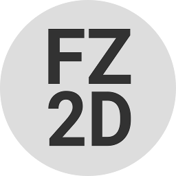

Fz2D
====
Fz2D is a 2D game engine and framework, designed with simplicity and
performance in mind from the ground up.



You should consider it *alpha quality*, as-in take everything with grain of salt
and pepper.

If you used [Flixel](http://flixel.org) and/or [Flash Punk](http://useflashpunk.net/) before, 
you'll feel right at home :recycle:.

You can check out a few small demos over [here](http://mihail.co/fz2d/demos).

Getting Started
---------------
It's easy peasy to get started.

#### Dependencies
* [node.js](http://nodejs.org)
* [npm](http://npmjs.org)
* [coffeescript](http://coffeescript.org)

```bash
npm install
```

To create a new `project` based on the provided template, all you need to do is following:

```
mkdir ~/hello_world
cake -p ~/hello_world create
cd ~/hello_world
npm install
cake build
```

To find out more `commands` just type `cake`.

What's missing?
---------------
There are certainly a lot of *things* missing and the _feature_ set shouldn't
be considered _full_ nor _final_ by any stretch of the imagination.

Contributions are always welcome and much appreciated.

Contribute
----------
* Fork the project.
* Make your feature addition or bug fix.
* Do **not** bump the version number.
* Send me a pull request. Bonus points for topic branches.

License
-------
Copyright (c) 2014-2017, Mihail Szabolcs

Fz2D is provided **as-is** under the **MIT** license. 
For more information see LICENSE.
